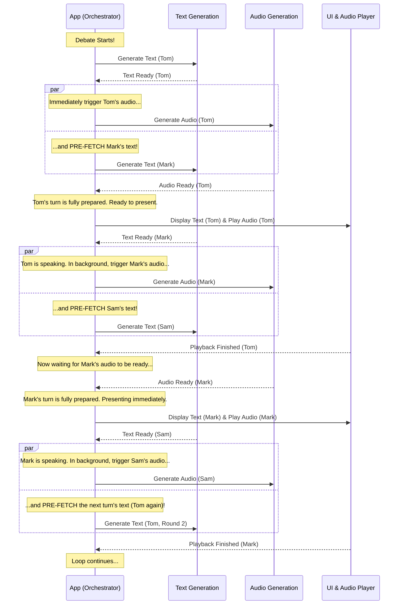

# 算法优化：AI 辩论的解耦异步流水线模型

## 1. 问题背景：串行模型的瓶颈

应用的初始版本遵循严格的**串行（Sequential）**模型。此模型的流程是：`生成文本 -> 等待 -> 生成语音 -> 等待 -> 播放语音 -> 等待播放结束 -> 重复`。这种方法的根本缺陷在于存在大量的“无效等待”时间，导致辩论节奏缓慢，用户体验不佳。

## 2. 解决方案：解耦异步流水线模型 (The Decoupled Asynchronous Pipeline)

为了达到极致的流畅体验，我们采用一种更先进的**解耦异步流水线**模型。这个模型的核心思想是将**文本生成**、**语音生成**和**界面呈现/播放**看作是三个独立的、并行的工作流，它们通过一个共享的“准备队列”进行通信，就像一个高效的工厂装配线。

### 2.1 核心原则

1.  **文本生成流 (Text Producer):** 这是一个持续不断的链条。一旦辩手 N 的文本生成完毕，系统会**立即**触发辩手 N+1 的文本生成请求。此流程的目标是尽快地产出文本内容，并填充准备队列，它不关心语音或播放的状态。

2.  **语音生成流 (Audio Producer):** 这是一个由“文本生成流”驱动的并行链条。一旦辩手 N 的文本可用，系统会**立即**为该文本请求生成对应的语音。这个流程与文本生成流并行工作，尽快将队列中“只有文本”的任务升级为“文本和语音都就绪”的任务。

3.  **呈现/播放流 (Consumer):** 这是唯一一个对用户而言**严格串行**的流程。它从准备队列的头部取出第一个“文本和语音都就绪”的任务进行显示和播放。只有在辩手 N 的语音播放完毕后，它才会去处理辩手 N+1 的任务。

### 2.2 装配线类比

-   **工位 1 (作家 - Text Generation):** 持续不断地写作下一位辩手的稿件。写完一份就立刻放到传送带上，然后马上开始写再下一份。
-   **工位 2 (配音员 - Audio Generation):** 盯着传送带。只要看到一份只有文字的稿件，就立刻拿过来配音。配好音后，再把完整的“稿件+录音”放回传送带。
-   **工位 3 (舞台监督 - UI Presentation):** 站在传送带的末端。他只拿取第一个“稿件+录音”都完整的成品，然后让演员（UI）上台表演（播放）。在当前演员表演结束前，他绝不会让下一个演员上台，确保了观众看到的顺序是正确的。

通过这种方式，传送带上（准备队列）总是堆积着正在处理和已完成的任务，舞台监督几乎不需要等待，从而实现了无缝的辩论流程。

---

## 3. 时序图 (Sequence Diagram)

这张图清晰地展示了各个服务之间如何并行工作，以及任务如何重叠。



---

## 4. 实施要点

-   **数据结构 (准备队列):** 需要一个核心的数据结构（例如一个数组）来作为队列。队列中的每个对象都应包含 `sender`, `text`, `audioSrc` 以及一个状态（如 `'text_ready'`, `'audio_ready'`, `'playing'`)。

-   **异步流程控制:** `debateLoop` 不再是一个简单的 `while` 循环。它将变成一个更复杂的**任务调度器**，负责：
    1.  启动初始的文本生成链。
    2.  监听任务完成事件（文本/语音就绪）。
    3.  根据事件触发下一步操作（请求语音/请求下一段文本）。
    4.  管理主播放循环，该循环从队列中消费已完成的任务。

-   **状态管理:** 需要精细化UI状态。例如，`speaking` 状态（思考动画）应该指向正在**预取文本**的辩手，而一个新增的 `nowPlaying` 状态可以用来高亮当前正在**实际说话**的辩手。

-   **可靠的停止机制:** `activeDebateLoop` 引用依然至关重要。当用户点击“停止”时，这个引用被清空。所有正在进行的异步操作 (`.then()` 回调) 在执行前都必须检查此引用是否有效，如果无效则立即中止，从而干净利落地停止整个流水线。
```

</change>
</changes>
```